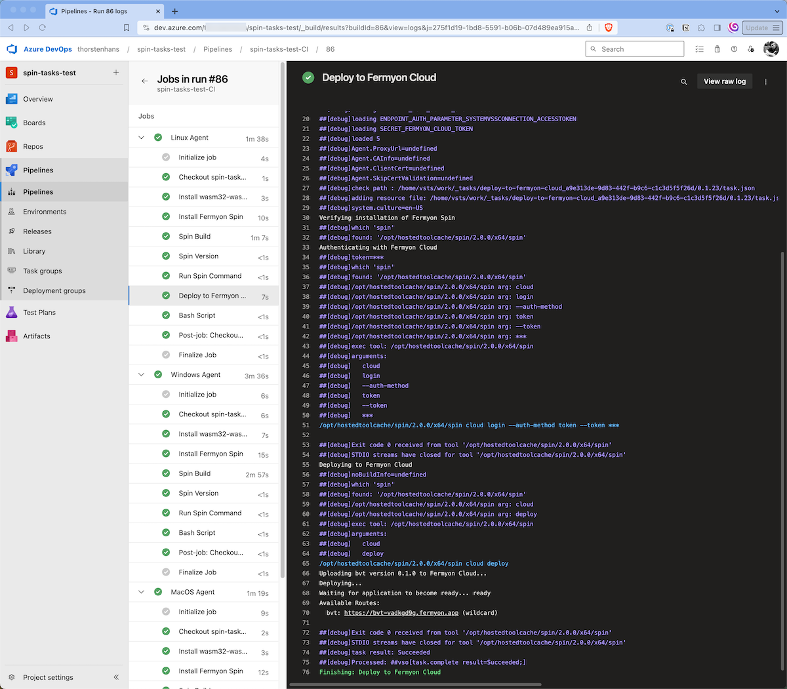
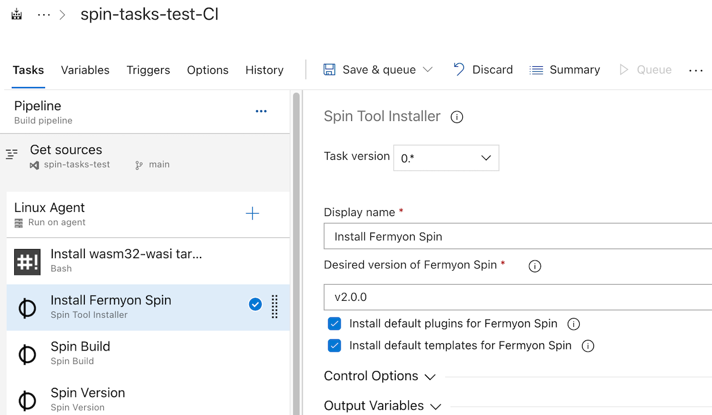
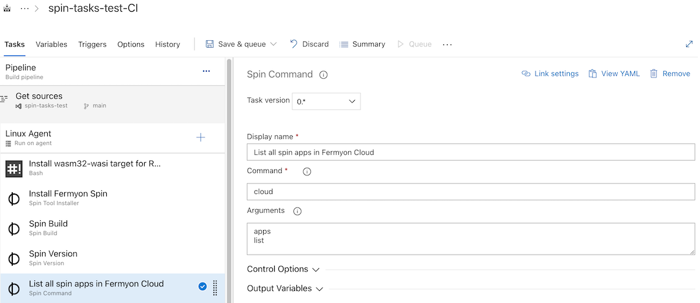
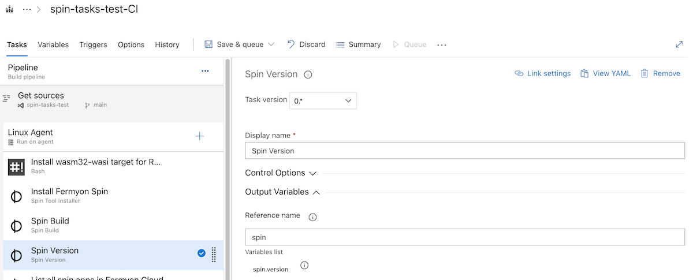
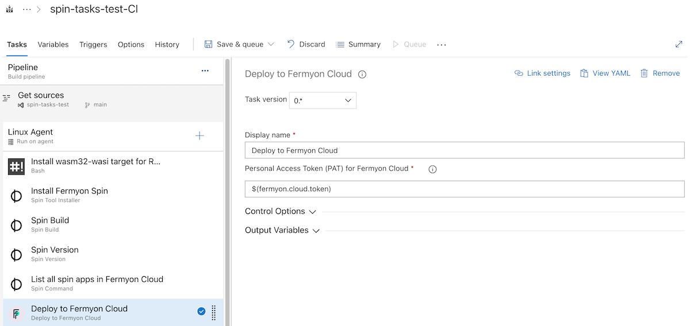

# Spin & Fermyon Cloud tasks for Azure DevOps

This is a collection of tools for Azure DevOps Pipelines to work with Fermyon Spin & Fermyon Cloud. Tools have been build and tested for Linux, macOS and Windows agents. Currently, `spin` is downloaded for the `amd64` architecture only.



## Spin Tool Installer

The *Spin Tool Installer* allows you to install any version of the `spin` CLI on your Azure DevOps Agent. By default, the task will download the **latest** version of `spin`. You can specify a different version by setting the `version` input variable as shown in the following figure:



```yaml
- task: thorstenhans.fermyon.spin-tool.spin-tool@0
  displayName: 'Install Fermyon Spin'
  inputs:
    version: v2.0.0
```

## Spin Build

The *Spin Build* task invokes `spin build` to compile your Spin application.

```yaml
- task: thorstenhans.fermyon.spin-build.spin-build@0
  displayName: 'Spin Build'
```

## Spin Command

The *Spin Command* tool allows users to invoke any command provided by `spin` CLI or its plugins. Users have to specify the `command` input variable. Optional arguments can be provided using the `arguments` input variable. One should separate arguments using a newline character (`\n`). The following figure shows an example of the *Spin Command* task:



```yaml
steps:
- task: thorstenhans.fermyon.spin-command.spin-command@0
  displayName: 'List all spin apps in Fermyon Cloud'
  inputs:
    command: cloud
    arguments: |
     apps
     list
```

## Spin Version

Use the *Spin Version* task retrieve the version of the `spin` tool installed on the agent. The task provides an output variable called `version` that could be referenced from within other tasks. Remember to specify the *Reference Name* of the *Spin Version* task as shown in the following figure:



Tasks can reference the output variable using the `$(<reference-name>.version)` syntax.

## Deploy to Fermyon Cloud

The *Deploy to Fermyon Cloud* task allows you to deploy your Spin application to Fermyon Cloud. The task requires a valid Fermyon Cloud account and a valid Spin application. To authenticate with Fermyon Cloud, you must generate a Personal Access Token (PAT) in your [Fermyon Cloud account](https://cloud.fermyon.com). Treat the PAT as sensitive information and store it as masked (sensitive) pipeline variable. (variable groups in Azure DevOps support this too).



```yaml
steps:
- task: thorstenhans.fermyon.deploy-to-fermyon-cloud.deploy-to-fermyon-cloud@0
  displayName: 'Deploy to Fermyon Cloud'
  inputs:
    token: '$(fermyon.cloud.token)'
```
